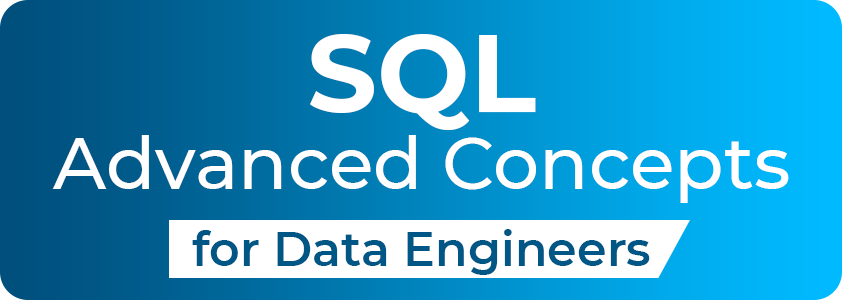
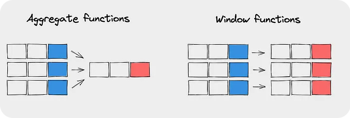
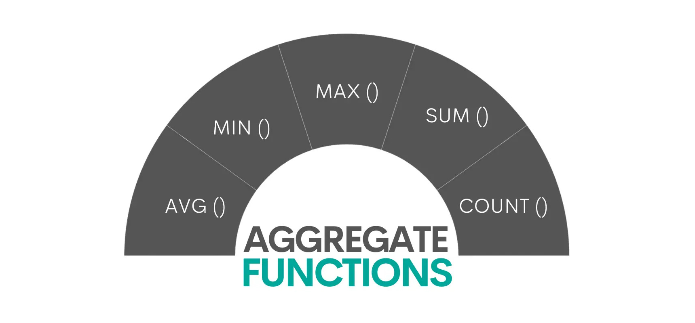
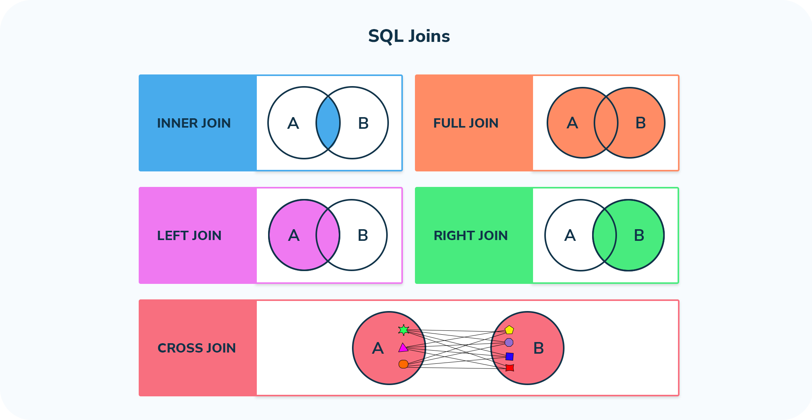

# Advanced SQL Concepts for Data Engineers

## Overview

In today’s software engineering landscape, SQL has become essential for data management and analysis. In this repository, you will find various advanced SQL concepts that I have tried to work on and master. The collection includes practical exercises and examples that cover subqueries, CTEs, window functions, aggregate functions, and joins, all aimed at enhancing Querying skills for real-world applications.

## Sections & Details

This repository is organized into several key sections, each focusing on a different advanced SQL concept. Each section contains practical examples and exercises to help you better understand and apply these concepts in real-world scenarios.

### Subqueries

In this section, I have explored various types of subqueries, demonstrating how they can be utilized to simplify complex queries and retrieve specific data efficiently.

### Common Table Expressions (CTEs)

Here, I provide examples of Common Table Expressions (CTEs) that showcase how to create temporary result sets, improving the readability and structure of SQL queries.

### Window Functions

This section focuses on window functions, where I illustrate their application in performing calculations across rows, allowing for advanced data analysis without losing row context.

### Aggregate Functions

I have included various examples of aggregate functions, highlighting their importance in summarizing data and generating insightful reports.

### Joins

In this section, I delve into different types of joins, showcasing how to combine data from multiple tables effectively to create comprehensive datasets.

## 🔗 Links

